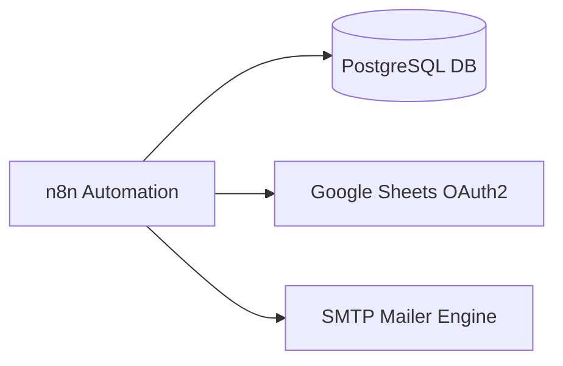

# ⚡ OutreachPilot — High-Performance Cold Email Automation Engine
> **Next.js & n8n Powered Cold Outreach Platform with Smart Deduplication & Anti-Spam Throttling**

---

```
┌─────────────────┐       ┌────────────────────────┐       ┌───────────────────────┐
│  Google Sheets  │ ────► │ Normalize & Lead Dedupe│ ────► │  Safe Batching / Loop │
│  (Leads Intake) │       │   (Postgres Check)     │       │   (Delay & Controls)  │
└─────────────────┘       └────────────────────────┘       └───────────┬───────────┘
                                                                       │
                                                                       ▼
                                                           ┌───────────────────────┐
                                                           │   SMTP Inbox Delivery │
                                                           │ (Clean & White-Label) │
                                                           └───────────────────────┘
```

---

## 📑 Fihrist (Quick Navigation)
* [🌟 Khusoosiyat (Core Features)](#-khusoosiyat-core-features)
* [📊 Google Sheet Format & Template](#-google-sheet-format--template)
* [⚙️ n8n Credentials Setup Guide](#️-n8n-credentials-setup-guide)
* [🖥️ Web UI Dashboard Controls Explained](#️-web-ui-dashboard-controls-explained)
* [🛡️ 1,000 Emails Safe Sending Strategy (Anti-Spam)](#️-1000-emails-safe-sending-strategy-anti-spam)
* [🔕 n8n Watermark & Footer Removal Trick](#-n8n-watermark--footer-removal-trick)
* [🔄 Deduplication & Stop Conditions](#-deduplication--stop-conditions)
* [🛠️ Hal-ul-Mushkilat (Troubleshooting & Error Codes)](#️-hal-ul-mushkilat-troubleshooting--error-codes)

---

## 🌟 Khusoosiyat (Core Features)

| Feature | Description | Benefit |
| :--- | :--- | :--- |
| **Smart Fallbacks** | Missing fields (name, website, city) auto-replace with dynamic defaults | Email kabhi adhoori ya ajeeb nahi lagti |
| **Double Deduplication** | Google Sheet + PostgreSQL history tracking | Ek lead ko do dafa email jaane ka 0% chance |
| **Adaptive Throttling** | Chunks (Batches) aur customized pauses (Delay seconds) | Domain reputation safe rehti hai, account block nahi hota |
| **Dual-Channel Target** | Business Email (`Email`) ya Personal Email (`Personal Email`) | Context ke mutabiq lead reachout |
| **100% White-Label** | Automatic unclosed hidden container encapsulation | n8n ka apna default footer recipient ko nazar nahi aata |

---

## 📊 Google Sheet Format & Template

Sheet ke Row 1 ke column headers exact ye hone chahiye:

```csv
First Name,Last Name,Email,Personal Email,Company,Website,Address
Ali,Khan,ali@techcorp.com,ali.khan99@gmail.com,TechCorp,https://techcorp.com,Lahore
Sarah,Ahmed,sarah@agency.io,sarah.ahmed@yahoo.com,Digital Boost,,Karachi
Usman,Tariq,usman@consulting.pk,,Apex Group,https://apex.pk,Islamabad
```

### 💡 Fallback Logic:
- Agar **`First Name`** missing ho ➔ Email me `"there"` ya `"friend"` chala jata hai.
- Agar **`Website`** missing ho ➔ Email me `"your website"` auto replace ho jata hai.
- Agar **`Address`** missing ho ➔ Email me `"your company"` lag jata hai.

---

## ⚙️ n8n Credentials Setup Guide

Aapke n8n workflow me 3 main connections darkaar hain:



### 1. Google Sheets OAuth2 (`QqgPYuqMGJABQWoh`)
- Google Cloud Console se OAuth Client ID & Secret connect karein.
- Node me apna Spreadsheet Document ID aur Sheet Name (`Sheet1`) select karein.

### 2. PostgreSQL (`HGYV1M1AJXX1CIzr`)
- Host, Database Name, User, aur Password check karein.
- Ye table sent leads ka record rakhta hai taake duplicate emails block hon.

### 3. SMTP (Google App Password) (`1oYk97pkmPMxmxDi`)
- **Host:** `smtp.gmail.com`
- **Port:** `465` (SSL) ya `587` (STARTTLS)
- **User:** `your-email@gmail.com`
- **Password:** **16-Digit App Password**
  > *Note: Apne Google Account me `Security -> 2-Step Verification -> App Passwords` se banayein.*

---

## 🖥️ Web UI Dashboard Controls Explained

Dashboard me 3 main settings hoti hain jo control karti hain ke email kab aur kaise jaye:

### 1. Primary Recipient Email Field
* **🔘 Default: Business Email (`Email` column):** Official corporate inbox par bhejna ho.
* **🔘 Optional: Personal Email (`Personal Email` column):** Lead ke private Gmail/Yahoo inbox par bhejna ho.

### 2. Sending Controls & Batching

```
Total Leads (100) 
  ├── Batch 1: 5 Emails ────► [ Wait 2s ]
  ├── Batch 2: 5 Emails ────► [ Wait 2s ]
  └── Batch N: 5 Emails ────► Completed!
```

* **Send Limit (Total):** Kitni leads ko email bhejna hai (e.g. `100`). Baqi leads safe rehti hain agle round ke liye.
* **Batch Size:** Ek round me kitni emails nikalni chahiye (Recommended: `5` se `10`).
* **Delay Between Batches:** Har batch ke darmiyan kitna pause hona chahiye (Recommended: `2` se `5` seconds).

---

## 🛡️ 1,000 Emails Safe Sending Strategy (Anti-Spam)

Agar aapko **1,000 emails** bhejni hain, to direct ek click me sab nahi bhejte. Ye formula follow karein:

| Stage | Daily Volume | Batch Size | Delay Between Batches | Status |
| :--- | :---: | :---: | :---: | :--- |
| **Day 1 - 2 (Warmup)** | 50 - 100 | 5 | 5 seconds | Domain Warmup |
| **Day 3 - 5 (Scale)** | 200 - 300 | 10 | 5 seconds | Reputation Building |
| **Day 6+ (Full Load)** | 500 - 1,000 | 10 - 20 | 8 - 10 seconds | Safe Full Automation |

---

## 🔕 n8n Watermark & Footer Removal Trick

n8n Community Edition email ke bilkul aakhri hissay me automatically ye line lagata hai:
`--- This email was sent automatically with n8n`

Isko gayab rakhne ke liye `Normalize & Apply Limit` node me email content ke aakhri hissay me hidden CSS container laga diya gaya hai:

```html
<div style="display:none !important; font-size:0px; line-height:0px; max-height:0px; opacity:0; overflow:hidden; mso-hide:all;">
```

Jab n8n apna footer add karega, to wo is invisible div ke andar chala jayega aur recipient ko 100% clean email nazar aayegi.

---

## 🔄 Deduplication & Stop Conditions

Agar sheet me 10 leads hain aur 9 pehle se bheji ja chuki hain:
1. Workflow automatically check karega.
2. Pehle se sent 9 leads ko **Skip** kar dega.
3. Sirf 1 nayi lead ko send karega.
4. Execution report me show karega:
   ```json
   {
     "status": "COMPLETED",
     "emailsSent": 1,
     "duplicateCount": 9,
     "message": "Campaign finished successfully. 9 duplicate leads were skipped."
   }
   ```

---

## 🛠️ Hal-ul-Mushkilat (Troubleshooting & Error Codes)

### 🔴 Error 535: Authentication Failed
* **Wajah:** Normal Gmail password use kiya gaya hai ya 2FA off hai.
* **Hal:** Google Account me 2FA on karein aur App Password generate karke n8n SMTP credentials me enter karein.

### 🔴 Error: `Cannot read properties of undefined (reading 'split')`
* **Wajah:** Sheet me Name ya Email ka column header ghalat spell hua hai ya space hai.
* **Hal:** Column headers ko check karein: `First Name`, `Last Name`, `Email`.

### 🔴 Automation Ek Email Bhej Kar Ruk Rahi Hai
* **Wajah:** Sheet me baqi rows duplicate hain ya database me pehle se logged hain.
* **Hal:** Sheet me naye test emails add karein ya database table clear karein.

---

### 🚀 Commands Cheat-Sheet

```bash
# Frontend dev server chalane ke liye:
npm run dev

# Port check karne ke liye:
netstat -ano | findstr :3000
```
